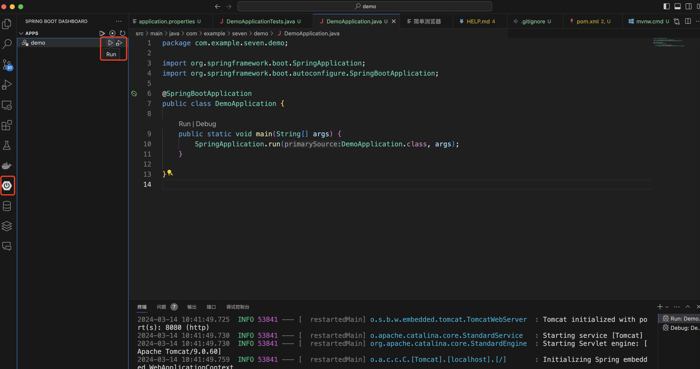

# VSCode中使用SpringInitializer

## 信息源

[Spring Initializer](https://start.spring.io/)
[VSCode 使用Spring Boot](https://code.visualstudio.com/docs/java/java-spring-boot)
[Spring Boot](https://spring.io/projects/spring-boot)

## 概述

在微服务架构中，会有很多功能独立的微服务，而这些服务在创建初期都需要要项目基线。可能在以前，我们会尝试用其它已经建立好的工程复制后，再删除些代码和包，但这种方式费时且过程很难标准化。如何快速而标准的建立项目，可以使用Spring Initialize进行快速的初始化一个代码结构。

## 具体步骤

### 环境配置

 在使用VSCode之间需要安装些扩展工具，参考[VSCode 使用Spring Boot](https://code.visualstudio.com/docs/java/java-spring-boot)

- 安装VSCode的扩展包
  - Spring Boot Tools
  - Spring Initializr
  - Spring Boot Dashboard

### 通过命令启动创建

在VSCode顶部的命令行输入, 后续步骤基本是按引导操作，并生成工程文件存放在指定的目录下。
`>spring initializer
`

[视频参考](https://code.visualstudio.com/docs/java/java-spring-boot/spring-initializr.mp4)

- 选择Spring Boot的版本和语言
- 设置包名
- 选择库依赖
- 设置工程文件存放的位置
- 导出工程文件

### 启动Web程序

- 通过Maven来编译拉取依赖库和编译原码后，即可启动。参考下图。

- 启动Web程序

### 查看代码目录

通过Initializer已经生成部分目录

- src源码目录: 代码路径和测试代码
- Resource目录下的application.property (可修改为application.yml)
- maven的包依赖文件Pom.xml

